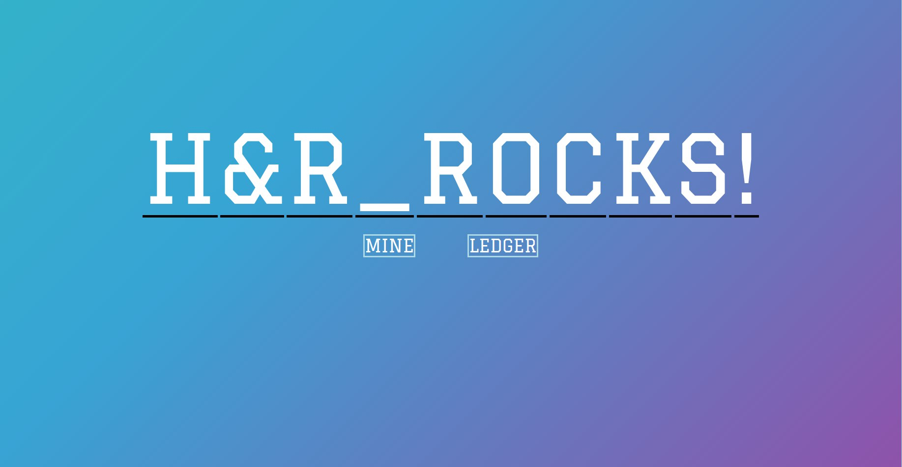

# Blockboard

Public web-board that displays a sentence made out of blockchain of letters. Any user can mine to change each letter in our public board, trying to put whichever message they want to show people. And the difficulty of mining increases with the number of competitors. BlockBoard is perfect for both professional cause, and for purely fun and competitive purposes. Developed as a proof-of-concept for blockchain based crowd message board in NUS Hack&Roll 2018.
